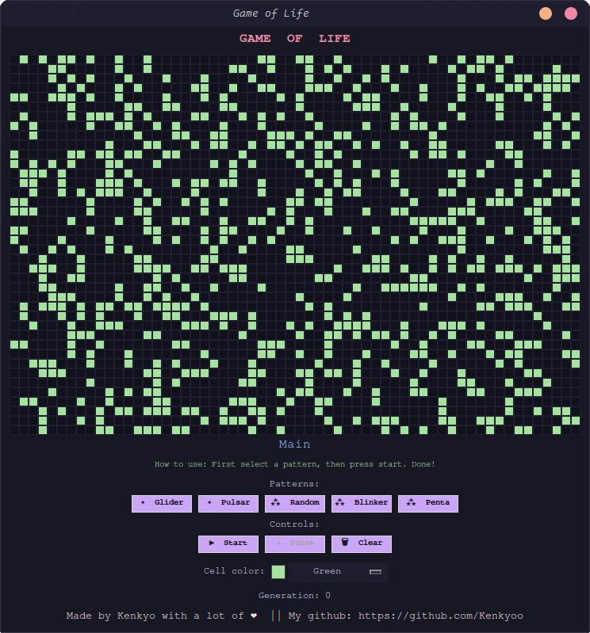
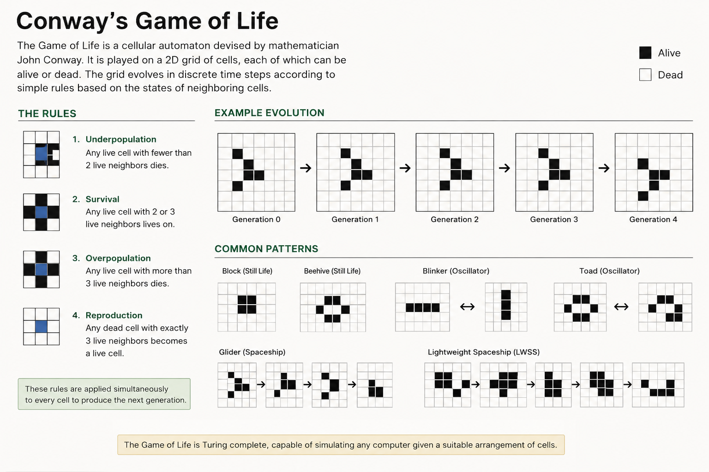

# Conway's Game of Life

Final project for [Code in Place](https://codeinplace.stanford.edu/) — Stanford University's introductory Python course.

---




## What is Conway's Game of Life?

The Game of Life is a **cellular automaton** devised by British mathematician **John Horton Conway** in 1970. It is not a game in the traditional sense — there are no players, no moves, and no winner. It is a **zero-player simulation** that evolves entirely from its initial state based on a simple set of rules.

The simulation takes place on a two-dimensional grid of cells, each of which can be either **alive** or **dead**. At every step (called a *generation*), the following four rules are applied simultaneously to every cell:

| Condition | Result |
|---|---|
| Live cell with 2 or 3 live neighbors | Survives |
| Live cell with fewer than 2 live neighbors | Dies (underpopulation) |
| Live cell with more than 3 live neighbors | Dies (overpopulation) |
| Dead cell with exactly 3 live neighbors | Comes alive (reproduction) |

From these four rules, remarkably complex and beautiful patterns emerge — stable structures, oscillators, and even patterns that move across the grid indefinitely.

---


## How to Run

**Requirements:** Python 3 with `tkinter` (included in standard Python installations).

```bash
python main.py
```

No external libraries are needed.

---


## How to Use

When the window opens, the grid starts empty. Here is the recommended flow:

1. **Load a pattern** — click one of the pattern buttons at the bottom (Glider, Pulsar, or Random) to populate the grid, or draw your own cells by clicking directly on the grid.
2. **Start the simulation** — press the **▶ Start** button to begin. Generations will advance automatically.
3. **Pause at any time** — press **⏸ Pause** to freeze the simulation. You can then click cells to edit the grid and resume.
4. **Clear the grid** — press **🗑 Clear** to reset everything and start over.
5. **Change cell color** — use the color selector at the bottom to switch the alive cell color in real time, even while the simulation is running.

### Predefined Patterns

- **Glider** — the most famous pattern in the Game of Life. A small shape that travels diagonally across the grid indefinitely.
- **Pulsar** — a period-3 oscillator: a symmetrical structure that cycles through three states and repeats.
- **Random** — fills the grid randomly at ~30% density. A great way to watch complex behavior emerge from chaos.

---


## How It Was Built

The project is written in a single file (`main.py`) using only Python's standard library.



### Key components

**`tkinter`** — Python's built-in GUI library, used to create the window, draw the grid on a `Canvas`, and handle all user interaction (button clicks, mouse drawing, dropdown selection).

**2D lists** — the grid is represented as a list of lists (`grid[row][col]`), where `0` is a dead cell and `1` is a live cell. A new grid is computed from the current one at every generation.

**Functions** — the logic is organized into small, focused functions:

- `create_grid()` — initializes an empty grid
- `count_neighbors()` — counts live neighbors for a given cell, with toroidal (wrap-around) edges so cells on the border connect to the opposite side
- `next_generation()` — applies Conway's four rules and returns the new grid
- `load_glider()`, `load_pulsar()`, `load_random()` — preset starting patterns

**`root.after()`** — tkinter's method for scheduling repeated actions without blocking the UI. Used to advance one generation every 80 ms, creating smooth animation.

**`StringVar` with `.trace()`** — a tkinter mechanism that automatically triggers a function whenever a variable changes. Used to update the cell color the moment a new color is selected from the dropdown.

---

## Project Structure

```
main.py   ← entire project in a single file
Images   ← wallpapers and images for readme
description.txt   ← description project for the course
README.md ← this file
```

---


## Author

Kenkyo

Made with a lot of love ❤️

Built as the final project for Code in Place 2025 — Stanford University.
